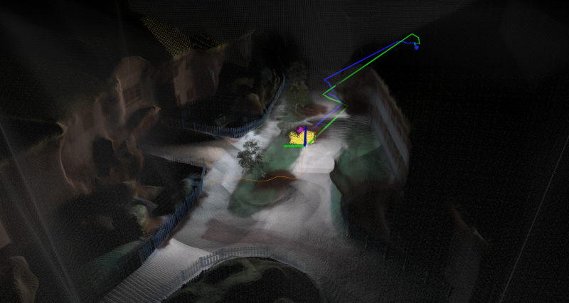

The repository sets an example to use [OMPL](https://ompl.kavrakilab.org/) for aerial vehicle route planning. The planner runs on top of [Aerial Navigation Development Environment](https://github.com/caochao39/aerial_navigation_development_environment) and extends the navigation to global scale. The planner replans at every planning cycle using environment observations accumulated along with the navigation, based on a point cloud representation. When navigating in unknown environments, the observed part of the environment becomes known and the unobserved part is considered free. The planner attempts multiple routes through replanning to guide the vehicle to the goal.

<p align="center">
  
</p>

## Prerequisite

Install OMPL using command lines below.

```
sudo apt install libompl-dev ompl-demos
sudo apt install ros-`rosversion -d`-ompl
```

## Usage

The repository has been tested in Ubuntu 18.04 with ROS Melodic and Ubuntu 20.04 with ROS Noetic. Follow instructions in [Aerial Navigation Development Environment](https://github.com/caochao39/aerial_navigation_development_environment) to setup the development environment and download the simulation environments.

To setup airOMPL Planner, clone the repository.
```
git clone https://github.com/MichaelFYang/airOMPL_planner
```
In a terminal, go to the folder and compile.
```
cd airOMPL_planner
catkin_make
```
To run the code, go to the development environment folder in a terminal, source the ROS workspace, and launch.
```
source devel/setup.sh
roslaunch vehicle_simulator system_gazebo.launch
```
In another terminal, go to the airOMPL Planner folder, source the ROS workspace, and launch.
```
source devel/setup.sh
roslaunch air_ompl_planner air_ompl_planner.launch
```
Now, users can send a goal by pressing the 'Goalpoint' button in RVIZ and then clicking a point to set the goal. The vehicle will navigate to the goal while observing the environment along the way, considering the environment as unknown at start. The planner replans in every planning cycle (green path) to account for newly observed environment and updates the path to execute (blue path) if a lower path cost is found. The red blocks represent observed areas and the green blocks are currently being observed areas.

<p align="center">
  
</p>

To launch with a different environment, please refer to the Advanced section in the development environment. Users can download five additional environment models and set the argument 'world_name' in the 'system_gazebo.launch' file to one of the environment names in the development environment, i.e. 'campus', 'indoor', 'garage', 'tunnel', and 'forest'. Note that if running on a slow computer, users can change 'world_name' to 'office_simple' to use a simple environment with reduced graphics rendering load.

## Configuration

airOMPL Planner settings are kept in default.yaml in the 'src/air_ompl_planner/config' folder.

- *robot_dim* (default: 0.6 (m)) - robot size for collsion checking
- *voxel_dim* (default: 0.15 (m)) - voxel size for point cloud downsizing
- *sensor_range* (default: 10.0 (m)) - sensor obstacle detection range
- *ceil_height* (default: 5.0 (m)) - maximum fly height

## Advanced

**Changing planner in OMPL**: Users can comment and uncomment code in 'src/air_ompl_planner/src/ompl_planner.cpp' to switch to a differnt planner in OMPL (RRT* (default), RRT-Connect, and BIT*)).

## Author

[Fan Yang](https://github.com/MichaelFYang) (michael.yfan24@gmail.com)
